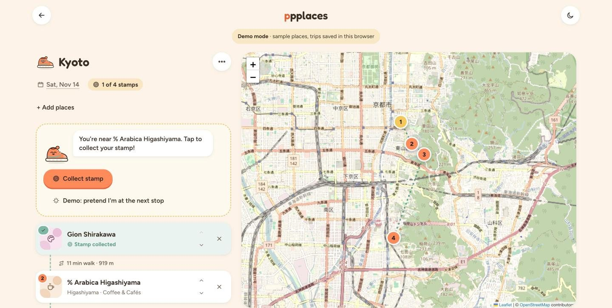
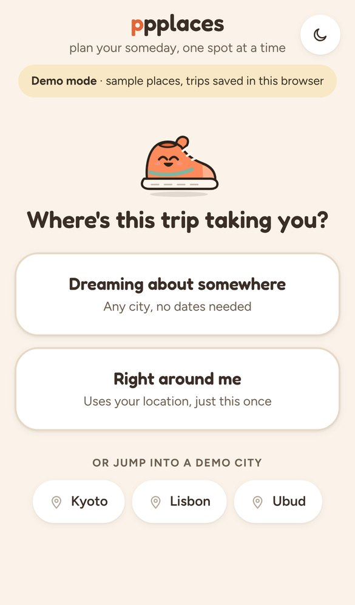
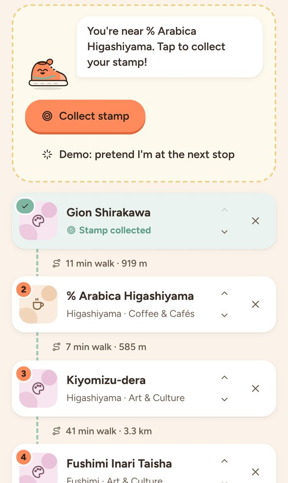
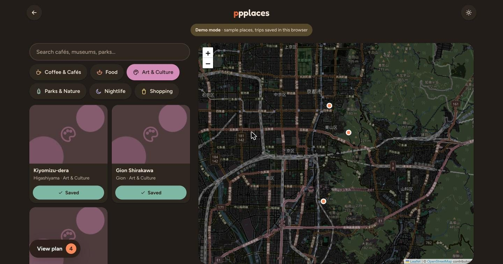

# ppplaces

**A playful, mobile-first trip planner that turns a pile of "places I want to see" into a walkable, optimized day.**

Designed, specced and built solo by [Iman Rafief](https://hhhelpstudio.com), from PRD to working app.

**[Try the live demo](https://ppplaces.pages.dev)** — no sign-up, no keys. Demo mode runs fully in the browser with sample places in Kyoto, Lisbon and Ubud.



<table>
  <tr>
    <td width="33%"></td>
    <td width="33%"></td>
    <td width="33%"></td>
  </tr>
</table>

---

## The problem

Planning a trip means juggling Google Maps, a notes app, blog posts and a group chat. Utility tools feel like admin work. Inspiration tools (Pinterest, TikTok saves) don't understand geography. And nothing is built for people who are still dreaming, with no dates booked yet.

ppplaces treats itinerary building as a quest: collect places, drop them onto a day, and get back a realistic, optimized route.

## What it does

- **Mood-based discovery.** Pick a vibe, search real places, save them to a trip.
- **Itinerary builder.** Drag to reorder stops, with an accessible tap-button fallback (not drag-only).
- **Optimize my day.** Reorders stops into an efficient walking route from your starting point (nearest-neighbor heuristic on haversine distance).
- **Dream mode to planning mode.** Plan without dates. Adding a date flips the trip to "planning."
- **Navigation handoff.** Opens the day, or a single stop, in Google Maps or Apple Maps.
- **Arrival stamps.** On a dated trip, check in at your stops: near a stop (120 m), Walkie offers the stamp and a tap collects it. GPS alone never awards anything, and location is only asked for when you tap.
- **Walkie, the guide.** A hand-drawn SVG sneaker with five poses (idle, happy, thinking, confused, celebrating) that carries empty states, loading, errors and wins instead of bare status text.
- **Desktop two-pane.** List on the left, sticky map on the right from 1024 px; single column on phones.
- **Guest sessions.** Start planning instantly with anonymous auth, no sign-up wall.
- **Demo mode.** With no API keys configured (or `?demo` in the URL) the app swaps in local fixtures, a Leaflet + OpenStreetMap map and localStorage trips, behind the same interfaces as the real services.

## Engineering highlights

- **API cost control.** Every Google Places call goes through a server-side proxy with field masking and caching, so the browser never sees the secret key and repeat searches don't re-bill.
- **Per-IP rate limiting.** Cloudflare KV counters on the metered endpoints stop a runaway client or scraper from running up the bill. Fails open if the binding is missing, so a config mistake can't take the API down.
- **Row Level Security.** Supabase Postgres schema where users can only read and write their own trips, days and stops.
- **Split key strategy.** A referrer-restricted browser key for map rendering, and an unrestricted key that only ever lives in server environment variables.
- **Swappable services.** Views talk to a `MapAdapter` (Google or Leaflet) and a `TripsBackend` (Supabase or localStorage). Demo mode is a different implementation of the same interface, not `if (demo)` checks scattered through the UI.
- **Typed without a build step.** JSDoc types checked by `tsc --noEmit` in strict mode, ESLint flat config, and `node:test` unit tests for the optimizer, handoff URLs, arrival logic and the demo backend. `npm run check` runs all three.
- **Accessibility.** Real buttons and labels throughout, visible focus rings, tap alternatives to drag reordering, live regions for Walkie's messages, and `prefers-reduced-motion` support.
- **Contrast.** A WCAG AA contrast pass caught that the original palette in my own spec fell short of 4.5:1. I darkened the values in the same hue family and documented them inline.

## Stack

| Layer | Tech |
|---|---|
| Frontend | Vanilla HTML, CSS, JavaScript (ES modules, no framework, no build step), JSDoc + TypeScript checking |
| Backend | Cloudflare Pages Functions |
| Database and auth | Supabase (Postgres, RLS, anonymous auth) |
| Maps | Google Places API (New), Maps JavaScript API; Leaflet + OpenStreetMap in demo mode |
| Tooling | TypeScript (`checkJs`), ESLint, `node:test`, Wrangler |
| Infra | Cloudflare Pages, Cloudflare KV |

## Process

I wrote the product spec before any code: problem, positioning, design system, feature specs, API cost strategy, KPIs and a 30-day MVP plan.

- [Product requirements (PRD)](docs/PRD.md)
- [User flow and behavior spec](docs/USER_FLOW.md)

## Project structure

```
public/js/
  app.js            boot: wires each view, picks the first screen
  core/             DOM helpers, app state, navigation registry, env (demo detection)
  data/             places + trips facades; supabase-trips.js and demo/ implement them
  lib/              pure logic: route optimizer, map handoff URLs, arrival check-in
  map/              MapAdapter + Google and Leaflet implementations
  ui/               icons, Walkie, theme, shared place UI
  views/            one module per screen: start, trips, discover, detail, plan, arrival
functions/api/      Cloudflare Pages Functions: Places, geocode, route proxies
test/               node:test unit tests
```

## Status

The full loop works end to end in both modes: start a trip, pick a mood, choose places, build and optimize the day, add a date, collect stamps on arrival, and hand off to navigation.

Next up: saved trips across devices (anonymous to email upgrade), badges for full days, and real walking durations from the Directions API instead of an 80 m/min estimate.

---

## Running it locally

**Demo mode** needs nothing but a static server:

```bash
npm install
npx serve public        # or: python3 -m http.server -d public
```

**Full mode** needs your own Google Maps Platform, Supabase and Cloudflare accounts.

1. **Google Cloud:** enable *Places API (New)* and *Maps JavaScript API*. Create two keys: one HTTP-referrer-restricted (browser) and one secret (server). Set a budget alert.
2. **Supabase:** create a project and run `supabase/schema.sql` in the SQL editor.
3. **Cloudflare:** create a Pages project and add `SUPABASE_URL`, `SUPABASE_SERVICE_ROLE_KEY` and `GOOGLE_MAPS_SERVER_KEY` as environment variables. Bind the `RATE_LIMIT` KV namespace under Settings > Functions.
4. Then:

```bash
cp public/js/config.example.js public/js/config.js   # SUPABASE_URL, SUPABASE_ANON_KEY, MAPS_BROWSER_KEY
cp .dev.vars.example .dev.vars                       # the three server secrets from step 3
npm install
npm run dev
npm run check   # types, lint, tests
```

`config.js` and `.dev.vars` are gitignored. Never commit real keys.
